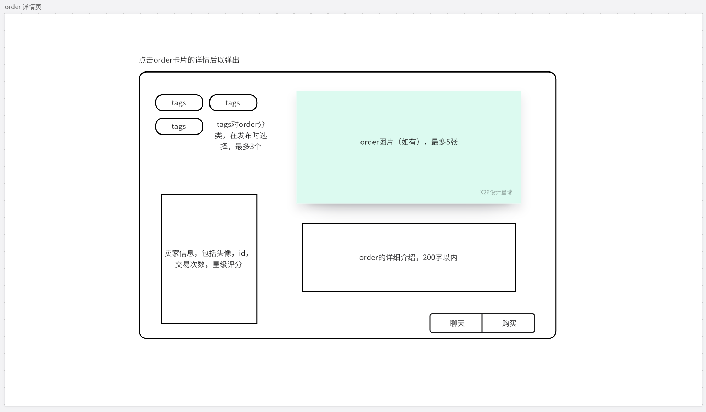

## 6. UI Design

We designed a simple and beautiful UI theme for the website, and displayed it on some pages that have been built. For example, on the homepage of the website, we have designed clear functional partitions for the convenience of users:

For the front-end pages that have not been completed yet, we have also designed the page layout and functional partitions to ensure the consistency of the overall theme. The following is the page design of the two main functions:

- Personal page:

  

- Order details page：

  