# Milestone2 Team Report

> Project Name: Sustech Order Platform
>
> Project Member: 陈逸书，张诗洋，田小龙，汪欣然，阮琪楷

### 1. Use Case Diagram

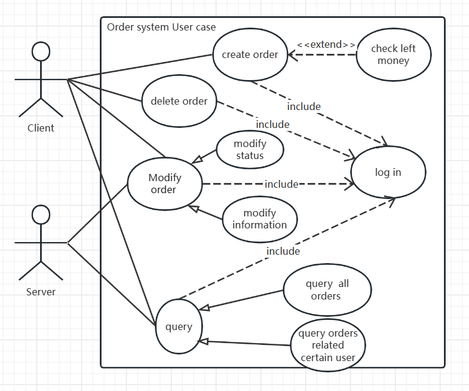

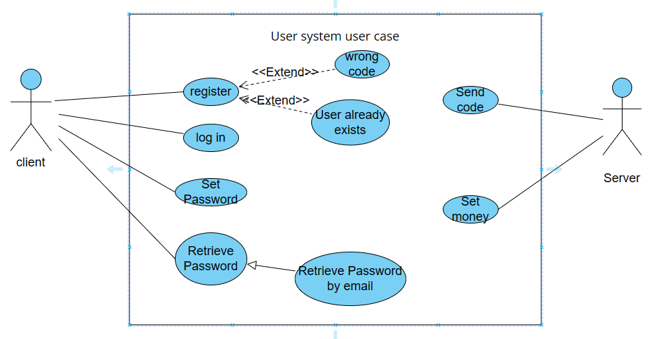

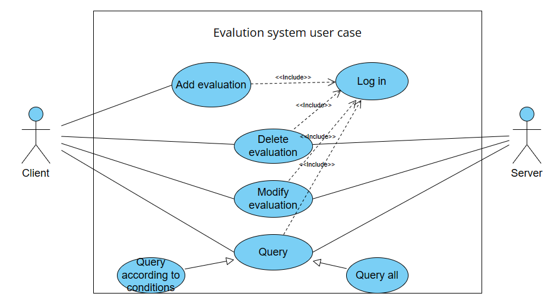

### 2.Swimlane Diagram

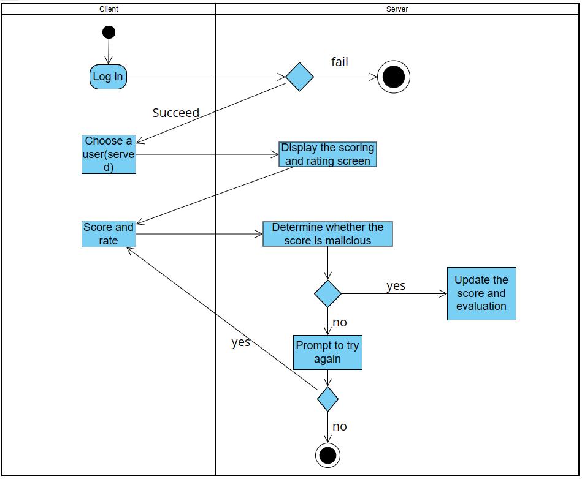

### 3.Natural Language Description

#### METADATA:

	Metadata                Example
	Name of the use case    Add evaluation
	Goal                    The users of the service evaluate the users of the service and ensure the objectivity of the evaluation
	Actors                  Client,server
	Trigger                 Once the service is complete
	Entry conditions        User completes login

#### Flow of events:

	Basic flow:
	1. Log in to the client
	2. The server authenticates the login
	3. The client selects the service user that it wants to evaluate
	4. The scoring and service interface is displayed
	5. The client will score and evaluate the service
	6. The server judges whether the score and evaluation are objective
	7. If the evaluation and rating are objective, the rating and rating will be updated
	
	Alternate flow:
	7. If the rating is not objective, ask the user whether to re-score
	
	Exception flow:
	2. Authentication failure

### 4. Diagram for logical view

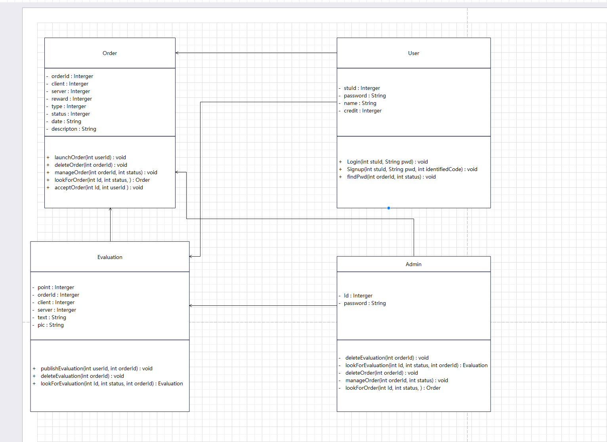

### 5. Data Design

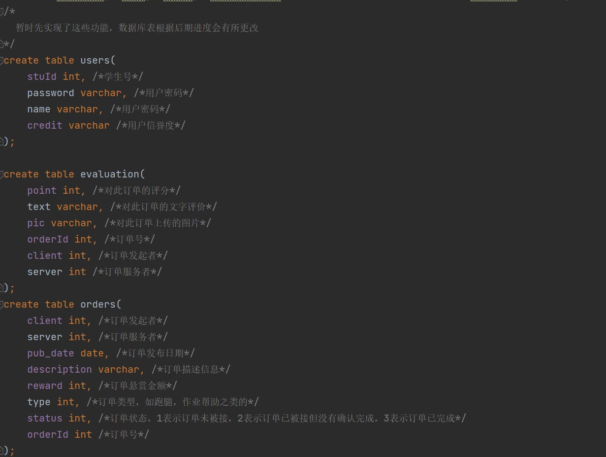

### 6. UI Design

We designed a simple and beautiful UI theme for the website, and displayed it on some pages that have been built. For example, on the homepage of the website, we have designed clear functional partitions for the convenience of users:

For the front-end pages that have not been completed yet, we have also designed the page layout and functional partitions to ensure the consistency of the overall theme. The following is the page design of the two main functions:

- Personal page:

  

- Order details page：

  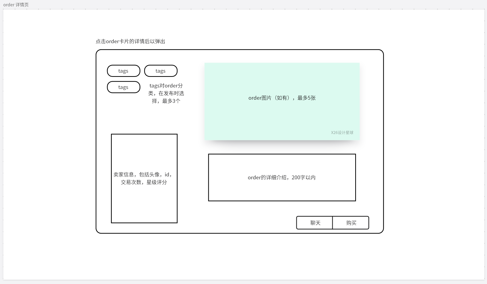

## Collaborations

### back-end repo:

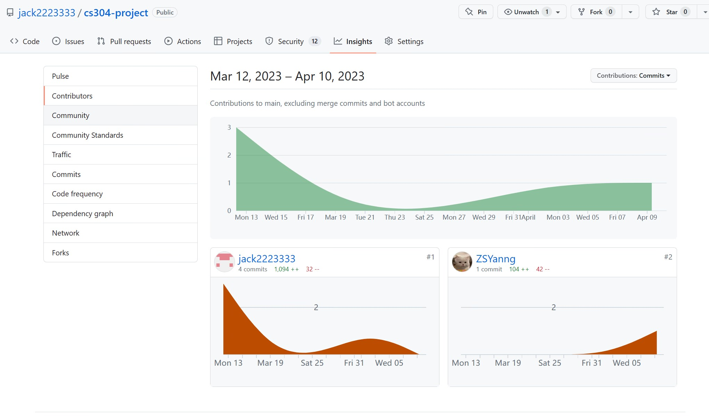

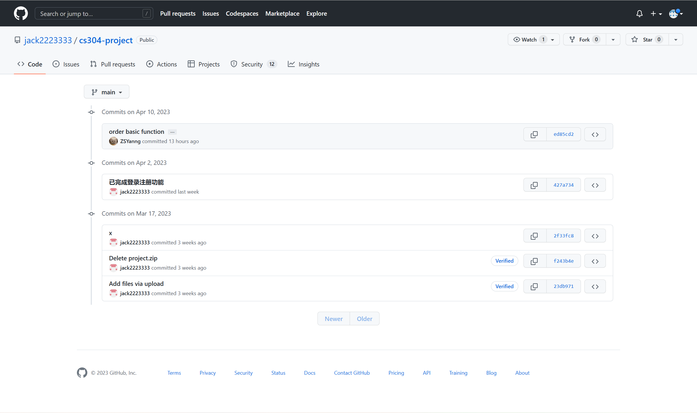

### front-end repo:

using `git log` + `pandas` to show commit distributions from all team members.

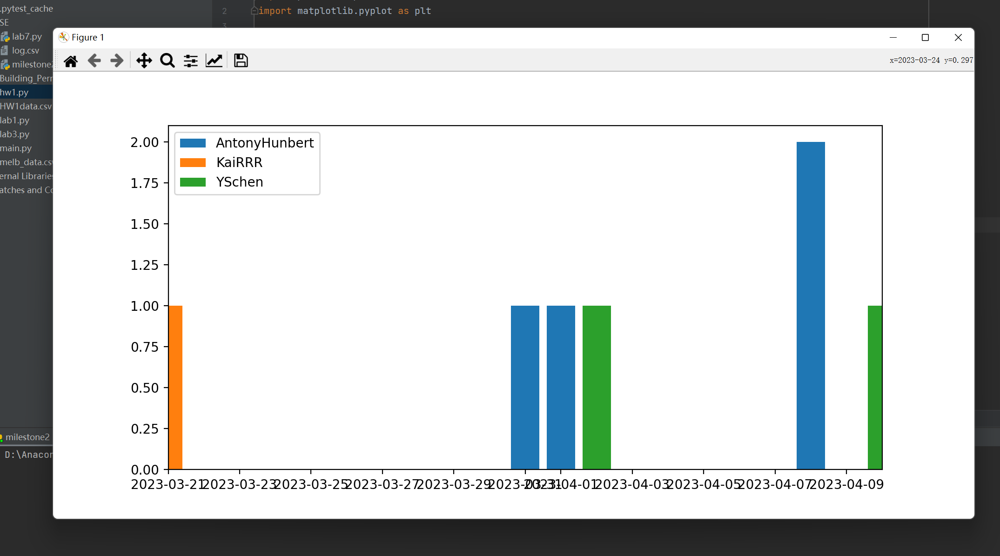

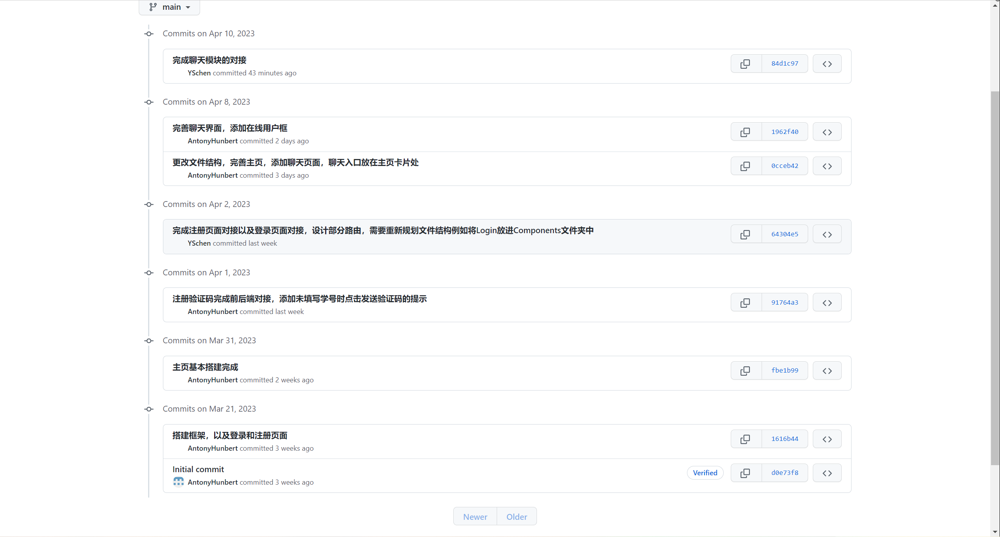

## Deliverables

At present, we have completed the user registration and login functions, and the chat function between users. At the same time, we have already classified different orders, and the functions of order initiation, acceptance and evaluation are also in progress.

- back-end directory & front-end directory:

  
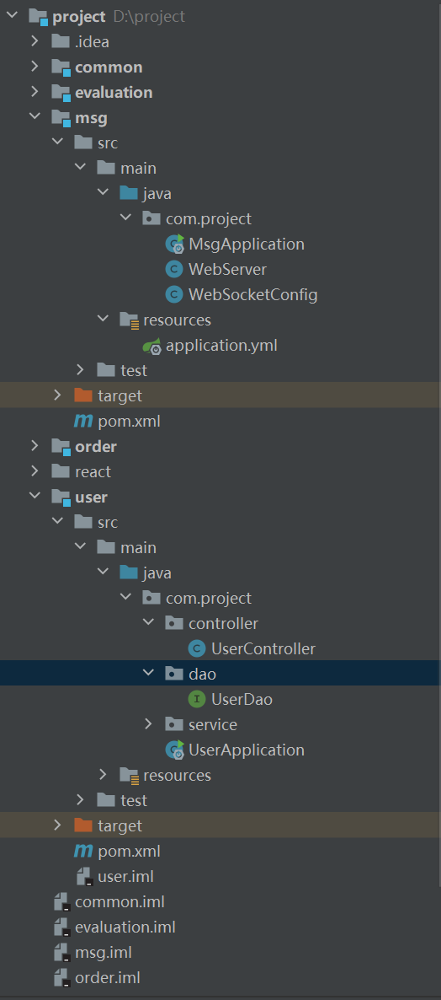     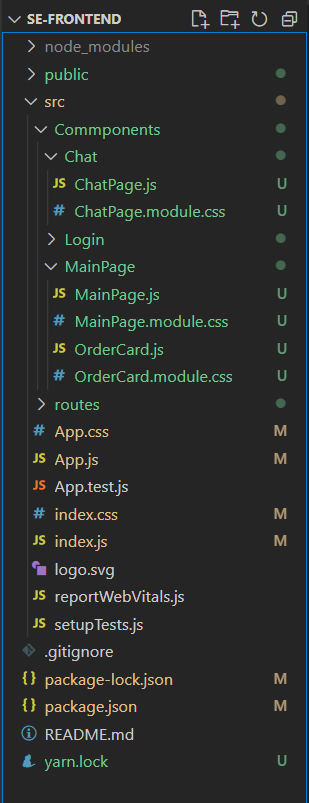 

   

